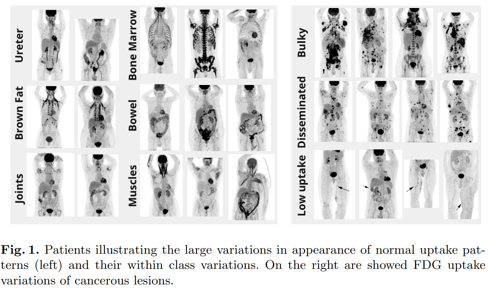
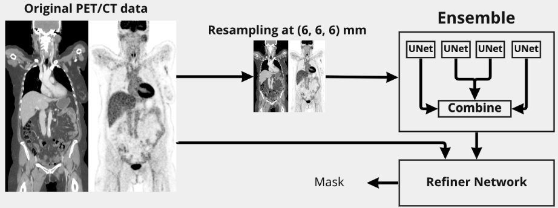
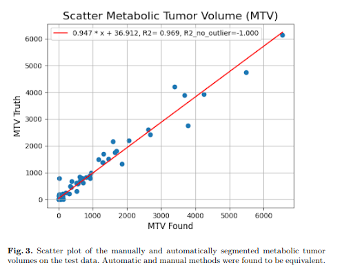
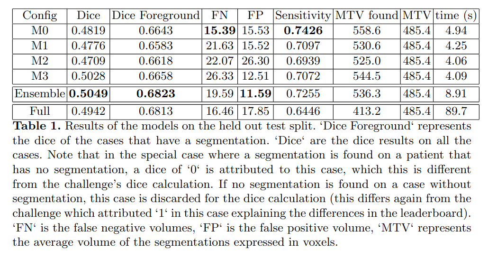
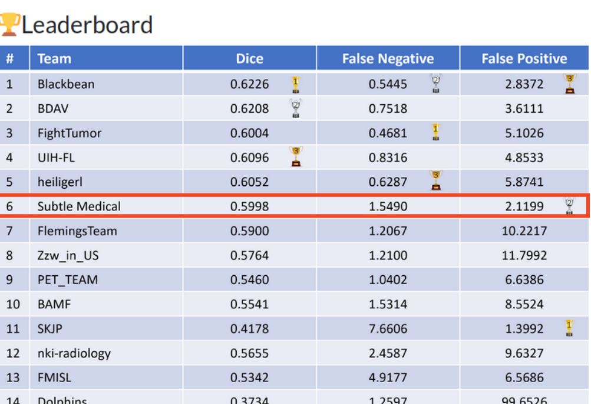

# AutoPET 2022 challenge

A repository for the AutoPET challenge (https://autopet.grand-challenge.org/)

## Code & dependencies setup

Using Conda:

    conda create -n autopet_sm python==3.9
    conda activate autopet_sm
    pip install -e trw
    pip install -e corelib
    pip install -e auto_pet

Update in `<root>/auto_pet/src/auto_pet/projects/segmentation/preprocessing/config/data.py`
the `<root>` variable. This is where the nifty files, preprocessing and training results will be stored.

## Data
Download the dataset `nifti.zip` from the challenge website and unzip in `<root>/dataset/raw/FDG-PET-CT-Lesions/`.

## Preprocessing

Preprocess and convert the nifty files to HDF5:

    cd <root>/auto_pet/src/auto_pet/projects/segmentation/preprocessing/
    python create_dataset.py

The preprocessed data will be stored here: `<root>/dataset/preprocessed/`

## Training

Run the training using:

    cd <root>/auto_pet/src/auto_pet/projects/segmentation/experiments/baseline/
    device=cuda:0 python 092_v13_strat_f0_sensitivity.py

## Results

Scripts will need to have some of the paths adjusted to your environment. Training results are stored here:

    <root>/logging2/

## Submission
### Introduction
PET with fluorine 18 (18F) fluorodeoxyglucose (FDG) has a substantial impact on the diagnosis and clinical decisions of oncological diseases. 18F-FDG uptake highlights regions of high glucose metabolism that include both pathological and physiological processes. 18F-FDG PET/CT adds value to the initial diagnosis, detection of recurrent tumor, and evaluation of response to therapy in lung cancer, lymphoma and melanoma.

FDG PET images are interpreted by experienced nuclear medicine readers that identify foci positive for 18F-FDG uptake that are suspicious for tumor. This classification of 18F-FDG positive foci is based on a qualitative analysis of the images and it is particularly challenging for malignant tumors with a low avidity, unusual tumor sites, with motion or attenuation artifacts, and the wide range of 18F-FDG uptake related to inflammation, infection, or physiologic glucose consumption.

### Patients
The challenge cohort consists of patients with histologically proven malignant melanoma, lymphoma or lung cancer who were examined by FDG-PET/CT in two large medical centers (University Hospital Tubingen, Germany and University Hospital of the LMU in Munich, Germany). Two expert radiologists with 5 and 10 years of experience annotated the dataset using manual free-hand segmentation of identified lesions in axial slices.

In total, 900 patients were acquired in 1014 different studies. 50% of the patients were negative control patients. Refer to [Gat+22] for additional information on the acquisition protocol. As can be seen in figure 1, a wide range of normal FDG uptakes were present such as brown fat, bone marrow, bowel, muscles, ureter and joints as well as within class variations. Similarly, patients with lesions showed large variations such as bulky, disseminated or low uptake patterns.

The dataset was split in 2 independent splits (development, test) at the patient level to avoid data leakage. The development dataset was further split in 15-fold cross-validation sets. Given the long tail distributions of the lesions, all the splits were stratified by overall lesion volume and number of lesions to minimize the model variance trained on different data slits.

### Data augmentation
We evaluated various data augmentation schemes and only the following ones
lead to marked improvements on the validation splits:

- Random axis flip for all three dimensions
- Random affine transformation which included random rotations and isotropic scaling
- PET only augmentation: random Gaussian blur, brightness, contrast and gamma transforms The refiner network had an additional transformation that resampled the data using random spacing to make the refiner completely independent from the original input resolution.

### Model
At a high level, the proposed model approach can be decomposed in 2 modules: the first module had a large field of view to analyse at a coarse level global patterns and long range dependencies. The analyzed images were fixed in resolution and downsampled to 6mm to make the module resolution independent. The goal of the second module was to refine the coarse segmentation found by the first module using the original image

The first module was composed of an ensemble of UNET like neural networks. UNET was modified to take as input 5x128x96x96 images. The channels were set to [64, 96, 128, 156] with a stride of 2 for each layer. Besides the change of channels, we also modified the middle block to have large kernels 93 to encourage the detection of long range dependencies. Leaky ReLU was used as activation function and instance normalization as normalization layer. We employed deep supervision to train the UNET. 4 UNETs were trained on different splits of the development dataset and their outputs were linearly weighted to form the 6mm intermediate segmentation mask

The refiner network took as input 5x64x64x64 images at original resolutions with the 6mm segmentation mask resampled to match the original image resolution. It was composed of a stem block with 9^3 kernel followed by 4 x (3^3 convolution, leaky ReLU, instance norm) residual blocks with a final 3^3 convolution to calculate the segmentation mask. The models were trained to minimize the following loss:

    loss = dice loss + 0.5 ∗ cross entropy loss + 2 ∗ sensitivity loss

Each model (UNET, ensemble stacking, refiner) were trained separately. We used AdamW as optmizer with a learning rate of 1e-3, weight decay of 1e-6 and a decayed cosine warm restart scheduler (T=200 epochs, decay=0.9 for each period). Finally, gradient clipping was applied to stabilize the training.

We report dice, dice of cases with foreground segmentation (‘foreground dice‘), sensitivity, False positive (FP) volume (volume of incorrectly segmented uptake that did not overlap with true segmentation), False negative (FN) volume (volume of incorrectly segmented uptake that did not overlap with true segmentation), metabolic tumor volume (MTV) for the evaluation of our method.

### Results on internal test dataset
930 cases were used for the training of the models and 84 cases were held out for the final evaluation. Qualitatively, the model produced accurate segmentations. It understood the typical variations in appearance of normal uptakes such as hot organs (e.g., kidneys, bladder, brain, heart, ureter), brown fat, bone marrow, inflammation (e.g., bowel joints), muscles. Similarly, the segmentations of lesions was accurate, all large lesions were segmented. Segmenting very small lesions or lesions with low FDG avidity was challenging. For the various trained models, we found that combining a dice loss with cross-entropy loss lead to a more stable training of the models. Similarly, deep supervision and gradient clipping lead to improved training stability. The sensitivity loss was encouraged the models to segment the smaller lesions but at the cost of additional false positives.

The whole pipeline took on average 89.7 seconds on a single V100 GPU per case, although no attempt were made to minimize inference speed. Automatic and manually segmented metabolically tumor volumes were equivalent. Table 1 shows that resulting dice were very similar for the models (M0-M3) trained on different splits. However, there were large variations in terms of False Negative (FN) and False Positive (FP) volumes as well as sensitivity despite an identical processing pipeline. The ensemble network had an improved ‘dice‘ and ‘dice foreground‘. Finally, the refiner network was able to keep very similar performance characteristics while operating on the full scale image with FP and FN volumes adequately rebalanced.

### Challenge Leaderboard
